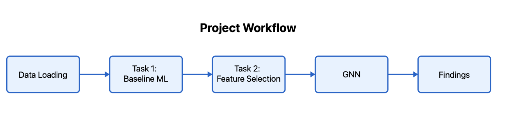
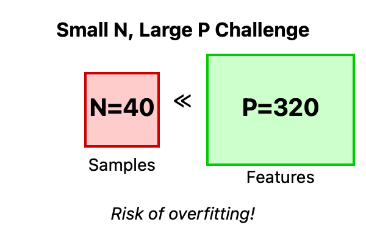
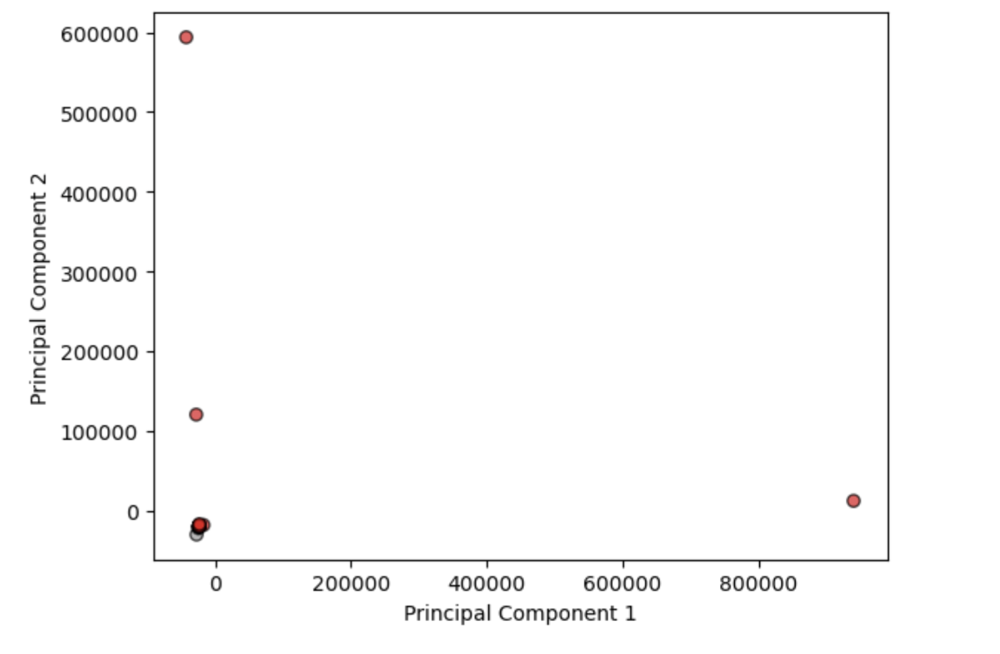
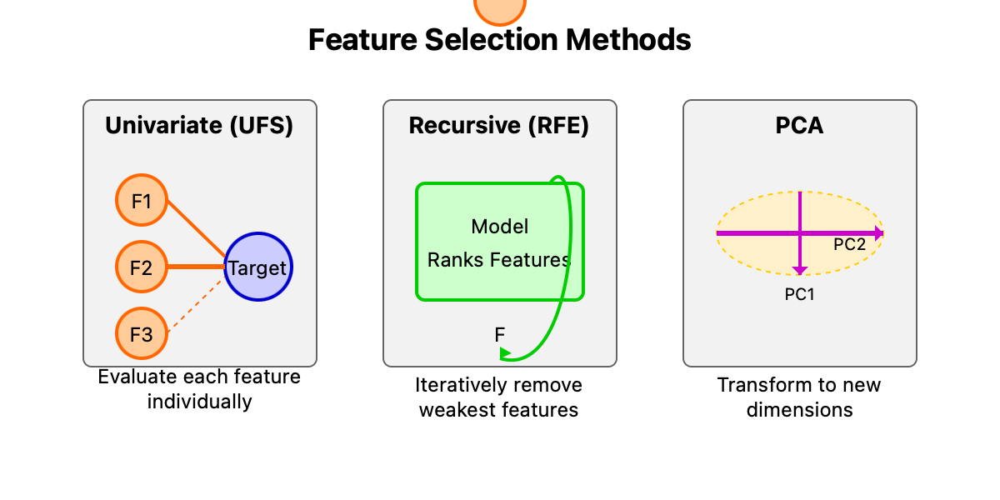
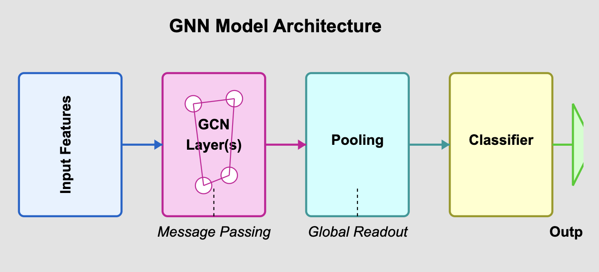

# EEG Brain State Classification - GSOC NEURODYAD Preliminary Task

## Overview

This repository documents the exploration of classifying EEG-derived brain states using a small (N=40), high-dimensional (320 features) dataset. This was a preliminary task for the **GSOC 2025 NEURODYAD project**. The analysis involved completing the requested tasks (baseline modeling, feature selection) and further exploring a novel approach using Graph Neural Networks (GNNs) to leverage the data's spatial structure. The goal was to understand data characteristics and evaluate standard/advanced approaches before tackling the main project's goals.

*(Figure: Project Workflow, including Tasks 1 & 2 and the Novel GNN Exploration)*

*(Figure: 64-Channel EEG Electrode Configuration Used)*

## The Challenge: Small Data, High Dimensions

 *(Figure: Conceptual Icon for N << P)*

*   **Samples (N):** 40
*   **Features (P):** 320 (64 channels x 5 bands)
*   **Problem:** High risk of overfitting, unreliable metrics, ineffective distance measures ("Curse of Dimensionality").

## Approach

The analysis followed these steps:

1.  **Task 1: Baseline Modeling:** Evaluated standard classifiers (Logistic Regression, SVM, KNN) using 5-Fold Cross-Validation.
2.  **Task 2: Feature Exploration:** Used UFS, RFE, and PCA to identify potentially important features.
3.  **Novel Approach: Graph Neural Networks (GNNs):** Explored GCNs, leveraging electrode topology and feature engineering, evaluated with K-Fold CV.

## Task 1: Baseline Model Performance (5-Fold CV)

Standard classifiers were tested using a robust 5-Fold Cross-Validation setup with scaling. Performance was generally poor, near or below random chance.

| Model                | Avg. Accuracy | Avg. F1 Score | Avg. AUC |
| :------------------- | :-----------: | :-----------: | :------: |
| Logistic Regression  | 0.300 ± 0.100 | 0.359 ± 0.090 | 0.288 ± 0.094 |
| SVM (RBF Kernel)     | 0.375 ± 0.079 | 0.226 ± 0.192 | 0.213 ± 0.123 |
| SVM (Linear Kernel)  | 0.300 ± 0.100 | 0.328 ± 0.082 | 0.275 ± 0.146 |
| SVM (Poly Kernel)    | **0.400 ± 0.050** | 0.109 ± 0.218 | 0.138 ± 0.139 |
| SVM (Sigmoid Kernel) | 0.325 ± 0.100 | 0.223 ± 0.206 | 0.138 ± 0.092 |
| KNN (k=5)            | 0.000 ± 0.000 | 0.000 ± 0.000 | 0.000 ± 0.000 |
| KNN (k=7)            | 0.000 ± 0.000 | 0.000 ± 0.000 | 0.000 ± 0.000 |

*Note: Results highlight the difficulty of learning from this limited dataset.*

*(Figure: PCA visualization showing lack of clear linear separability)*

## Task 2: Feature Selection

Different methods yielded different top features due to their distinct evaluation strategies. Using these subsets did not significantly improve CV performance.

*(Figure: Conceptual difference between UFS, RFE, and PCA)*

| Method | Top 5 Features Selected (Example Run)                 | Focus                               |
| :----- | :---------------------------------------------------- | :---------------------------------- |
| **UFS** | `alpha10`, `gamma23`, `gamma34`, `gamma38`, `gamma45` | Individual feature predictive power |
| **RFE** | `alpha41`, `beta43`, `theta21`, `theta29`, `theta62`  | Collective features for model perf. |
| **PCA** | `beta17`, `theta1`, `delta6`, `delta47`, `delta45`   | Capturing maximum data variance     |

*Note: PCA features listed are original features with highest loadings on top components.*

## Novel Approach: Graph Neural Networks (GNNs)

Motivated by the spatial arrangement of EEG electrodes, GNNs were explored as an advanced technique beyond the core tasks.

*(Figure: Simplified GCN Architecture)*

**GNN Performance (GCN with Feature Eng. & 5-Fold CV):**

| Metric    | Average Score     |
| :-------- | :---------------: |
| Accuracy  | 0.5000 ± 0.1369   |
| F1 Score  | 0.4931 ± 0.2586   |
| AUC       | **0.5625 ± 0.1630**   |

*Note: While showing the highest average AUC, GNNs still performed near chance level overall, indicating the data limitation persisted even with structural information and this novel approach.*

*(Figure: Example GNN training/validation curves, often showing overfitting or stagnation)*

## Key Findings & Conclusion

*   **Task Completion:** Tasks 1 and 2 were successfully completed, revealing poor baseline performance and diverse feature importance perspectives.
*   **Poor Generalization:** All tested models (baseline and GNN exploration) performed near or below chance levels under cross-validation.
*   **Data Limitation:** The primary bottleneck is the extremely small sample size (N=40) relative to the high feature dimension (P=320).
*   **Novel Exploration Confirms Limits:** The additional GNN exploration, while theoretically sound, confirmed that even advanced structural modeling could not overcome the fundamental data scarcity issues.

**This outcome strongly motivates the use of methods like CEBRA on richer, time-series dyadic data, as planned for the main GSOC NEURODYAD project.**

## Repository Structure

*   `/notebooks`: Jupyter notebooks for each analysis phase.
    *   `01_Baseline_ML_Classification.ipynb`: Task 1 (Initial single split results).
    *   `02_Feature_Selection_Analysis.ipynb`: Task 2 implementation.
    *   `03_GNN_Exploration.ipynb`: (Novel Approach) Initial GNN attempts.
*   `/data`: Raw dataset (`EEG data.csv`).
*   `/images`: Supporting visual assets.
*   `README.md`: This file.
*   `full_documentation.md` / `eeg_classification_report.pdf`: Detailed documentation/report.

## Connection to GSOC NEURODYAD Project

This preliminary work confirms the need for advanced techniques like **CEBRA on time-locked dyadic EEG data** proposed in the main NEURODYAD project. The limitations encountered here underscore the potential of CEBRA to handle high-dimensional temporal data and extract meaningful dynamics, especially when combined with post-embedding analyses (TDA, dynamics) for clinical comparisons.

## Overall Conclusion So Far

This exploration fulfilled the preliminary task requirements and, through additional GNN exploration, thoroughly demonstrated the significant limitations of the provided dataset. The focus now shifts entirely to the main GSOC goal: implementing CEBRA for dyadic EEG, leveraging its strengths in analyzing temporal dynamics, and applying advanced post-embedding analysis (TDA, dynamical systems) to uncover subtle differences in neural interaction patterns between groups. Find the code at [github.com/daksh-mor/cebra/tree/main](https://github.com/daksh-mor/cebra/tree/main).
