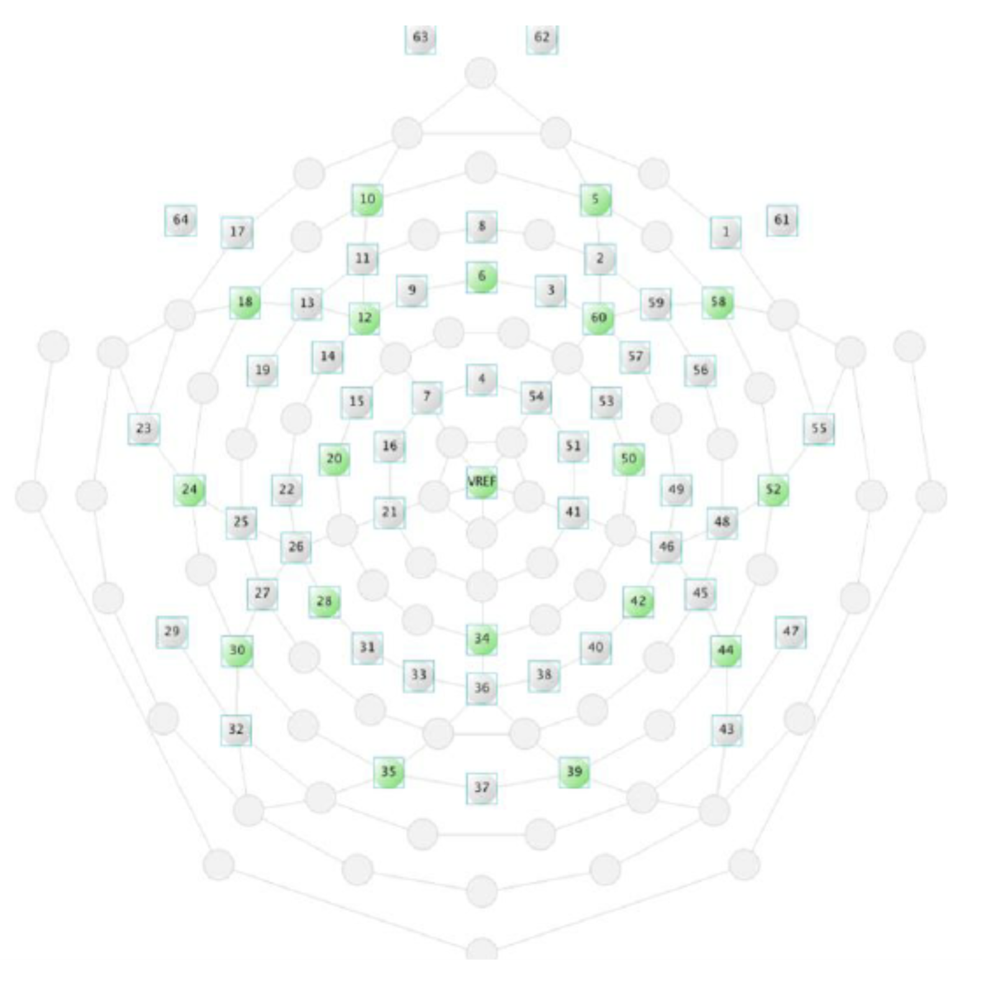
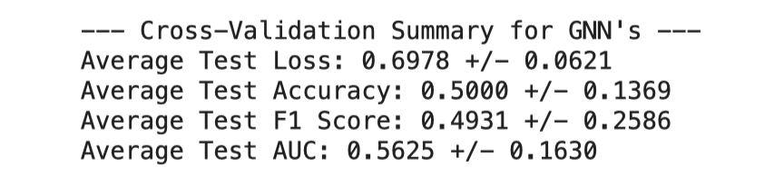

# EEG Brain State Classification-GSOC NEURODYAD Preliminary Task Exploration

## Overview

This repository documents the systematic exploration undertaken for the preliminary test task associated with the **GSOC 2025 NEURODYAD project**. The test involved classifying participant brain states (binary) using a provided dataset (N=40 samples) containing static EEG band power features (alpha, beta, delta, theta, gamma) from a 64-channel setup.

**The primary goal of this exploration was to assess the dataset's characteristics and evaluate standard machine learning and graph-based approaches before tackling the main project's focus on CEBRA and time-locked dyadic EEG data.**

*(Figure: 64-Channel EEG Electrode Configuration)*

## The Challenge: Small Data, High Dimensions

A key characteristic of this test dataset is its size: only **40 samples** with **320 features** (64 channels x 5 bands). This presents significant challenges:

*   High risk of overfitting.
*   Difficulty in learning generalizable patterns.
*   Unreliable performance metrics on small test sets.
*   Standard distance/similarity measures (like in KNN) become less effective.

Recognizing these limitations guided the structured approach documented here.

## Approach & Methodology

The analysis was conducted in phases:

1.  **Baseline Modeling (Task 1):** Standard ML classifiers (Logistic Regression, SVM with multiple kernels, KNN) were applied using 5-Fold Stratified Cross-Validation to establish initial performance benchmarks on the raw features. ([See Notebook 01](notebooks/01_Baseline_ML_Classification.ipynb))
2.  **Feature Exploration (Task 2):** Different feature selection/reduction techniques (Univariate Selection, Recursive Feature Elimination, PCA) were used to identify potentially informative feature subsets and understand feature importance from different perspectives. ([See Notebook 02](notebooks/02_Feature_Selection_Analysis.ipynb))
3.  **Graph Neural Networks (GNNs):** Leveraging the inherent spatial structure of the EEG channels, GNNs (GAT and GCN) were explored. This included:
    *   Defining the graph structure based on electrode adjacency.
    *   Implementing robust K-Fold Cross-Validation for GNNs.
    *   Testing model simplification, hyperparameter tuning, feature scaling, and Layer Normalization.
    *   Attempting feature engineering by adding regional averages and band power ratios as node features. ([See Notebook 03](notebooks/03_GNN_Exploration.ipynb))

## Key Findings & Conclusion from Test Task

Across all phases and models, a consistent pattern emerged:

*   **Poor Performance:** All tested models (standard ML and GNNs) performed at or significantly below random chance (Avg. AUC often < 0.5) when evaluated using robust cross-validation.
*   **Data Limitation:** The extremely small sample size (N=40) is the most likely primary limiting factor, preventing models from learning generalizable patterns and likely causing them to overfit noise or spurious correlations.
*   **Signal Strength:** The static band power features, even with feature selection, engineering, and graph structure incorporated, appear to lack a strong, discernible signal for reliably classifying the two brain states in this specific dataset.
*   **Feature Selection Divergence:** UFS, RFE, and PCA correctly identified different "top" features, highlighting their distinct underlying mechanisms for evaluating importance.

**In conclusion, this thorough exploration of the preliminary test dataset successfully demonstrated the application of various ML and GNN techniques but ultimately highlighted the significant challenges posed by the dataset's size and potential lack of signal in the provided static features. This outcome strongly motivates the use of more advanced techniques like CEBRA on richer, time-series dyadic data, as planned for the main GSOC project.**

## Repository Structure

*   `/notebooks`: Contains Jupyter notebooks detailing each phase of the analysis.
    *   `01_Baseline_ML_Classification.ipynb`: Task 1 implementation and results.
    *   `02_Feature_Selection_Analysis.ipynb`: Task 2 implementation and results.
    *   `03_GNN_Exploration.ipynb`: GNN (GAT/GCN) implementation, feature engineering, and results.
*   `/data`: Contains the raw dataset (`EEG_data_-_Sheet1.csv`).
*   `/images`: Contains supporting images .
*   `README.md`: This file.

## Connection to GSOC NEURODYAD Project

This repository documents the work performed on the preliminary test task. The findings here reinforce the need for the advanced methods proposed in the main NEURODYAD project, specifically using **CEBRA on time-locked dyadic EEG data**. The challenges encountered with static features and small sample size highlight the potential benefits of CEBRA's contrastive learning approach for uncovering meaningful neural dynamics from richer temporal datasets and adapting it for clinical comparisons.

## Overall Conclusion So Far

Recognizing the limitations inherent in the small, static test dataset, simply achieving high performance on that specific task was deemed less critical than demonstrating a robust methodology and identifying the need for more advanced approaches. Therefore, while the preliminary tasks were thoroughly completed as documented above, the proposed focus for the main GSOC project shifts entirely towards the core goal: implementing the CEBRA pipeline for time-locked, dyadic EEG data. Insights gained from the CEBRA documentation and key papers (notably Schneider et al., 2023 on the method itself, and McCleod et al. on the clinical context of ASD differences) highlight the potential of CEBRA's self-supervised, contrastive learning approach to generate consistent and interpretable latent embeddings from high-dimensional temporal data like EEG – capabilities essential for overcoming the challenges faced with the static test features. While static measures like power-law exponents (McCleod et al.) can reveal group differences, CEBRA offers a powerful lens into the temporal dynamics underlying social interaction. To provide significant novelty and fully exploit these rich embeddings, I propose concentrating on advanced post-embedding analysis leveraging topological and dynamical systems perspectives. This involves applying techniques such as Topological Data Analysis (TDA) to quantify the 'shape' of the neural state manifolds and analyzing state transition dynamics and embedding-space connectivity within the learned CEBRA latent space. By comparing these sophisticated metrics between neurotypical and clinical dyads, this approach aims to uncover potentially subtle but crucial differences in interaction dynamics, directly addressing the project's goal of identifying differentiating neural parameters and showcasing a deeper, research-oriented application of CEBRA well beyond the scope of the preliminary test.
