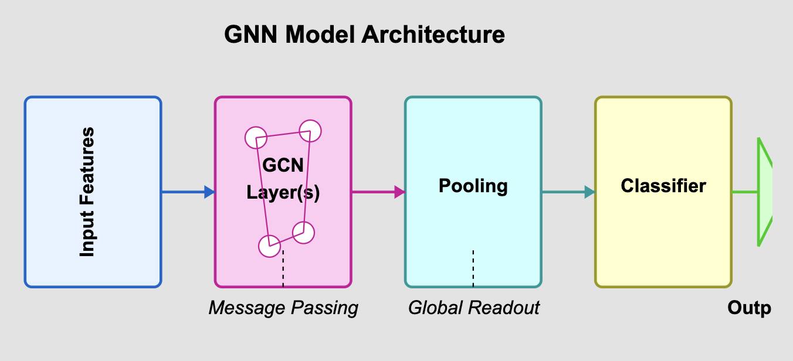

# EEG Classification for Metabolic State Detection: Detailed Analysis

## 1. Introduction: Understanding the Data

This project analyzes Electroencephalography (EEG) data to classify brain states associated with different metabolic conditions.

### EEG Basics

*   **Technique:** Records electrical activity from the scalp.
*   **Setup:** 64 electrodes placed according to an extended 10-20 system.
*   **Features:** Power spectral density calculated for 5 standard frequency bands at each electrode.

*(Figure: 64-Channel EEG Electrode Configuration)*

### Frequency Bands Analyzed

| Band    | Frequency Range | Associated Brain States                                |
| :------ | :-------------: | :----------------------------------------------------- |
| Delta   | 0.5 - 4 Hz      | Deep sleep, non-REM sleep                              |
| Theta   | 4 - 8 Hz        | Drowsiness, meditation, creativity, light sleep        |
| Alpha   | 8 - 13 Hz       | Relaxed wakefulness, calmness, eyes closed             |
| Beta    | 13 - 30 Hz      | Active thinking, concentration, alertness, anxiety     |
| Gamma   | 30 - 100 Hz     | Higher cognitive processing, learning, sensory binding |

## 2. Dataset Overview

*(Figure: High-Level Project Pipeline)*

| Characteristic      | Value                                              | Implication                                       |
| :------------------ | :------------------------------------------------- | :------------------------------------------------ |
| **Samples**         | 40 (20 per class)                                  | Extremely small dataset size                      |
| **Features**        | 320 (64 electrodes × 5 bands)                      | High-dimensional space                            |
| **Target**          | Binary (0 or 1 metabolic state)                    | Balanced classification task                      |
| **Primary Challenge** | **N << P** (Samples << Features)                   | High risk of overfitting, unreliable evaluation   |

## 3. Task 1: Baseline Classification Models

Initial evaluation using standard ML algorithms. Results below are from **single train/test splits (80/20)** unless specified as CV.

### Model Performance (Single Split Validation)

| Model               | Kernel/K | Train Acc. | Val. Acc. | Train F1 | Val. F1 | Notes                                   |
| :------------------ | :------- | :--------: | :-------: | :------: | :-----: | :-------------------------------------- |
| Logistic Regression | -        | 1.000      | 0.250     | 1.000    | 0.250   | Poor generalization, likely overfit     |
| SVM                 | Linear   | 1.000      | 0.375     | 1.000    | 0.286   | Poor generalization                     |
| SVM                 | Poly     | 0.563      | **0.500** | 0.696    | **0.667** | Better, but still near chance           |
| SVM                 | RBF      | 0.594      | 0.375     | 0.711    | 0.545   | Overfitting                             |
| SVM                 | Sigmoid  | 0.594      | **0.500** | 0.711    | **0.667** | Better, but still near chance           |
| KNN                 | k=1      | 1.000      | 0.250     | 1.000    | 0.250   | Severe overfitting                      |
| KNN                 | k=3      | 0.813      | 0.125     | 0.824    | 0.222   | Very poor generalization                |
| KNN                 | k=5      | 0.688      | 0.000     | 0.688    | 0.000   | Fails completely on validation          |
| KNN                 | k=7      | 0.656      | 0.250     | 0.593    | 0.250   | Poor generalization                     |

*(Figure: PCA shows poor linear separability, explaining low linear model performance)*

### Interpretation

*   **Non-Linearity:** Linear models perform poorly; non-linear SVM kernels (Poly, Sigmoid) perform slightly better (~50% Acc), suggesting non-linear patterns.
*   **Overfitting:** All models show a large gap between training and validation scores.
*   **Curse of Dimensionality:** KNN performance collapses, likely due to meaningless distance calculations in 320 dimensions with only 40 points.
*   **Data Limitation:** Performance is generally poor, indicating the models cannot learn robust patterns from the limited data.

### Baseline Performance (5-Fold Cross-Validation)

Repeating the baseline evaluation with robust 5-Fold CV confirms the poor performance:

| Model                | Avg. Accuracy | Avg. F1 Score | Avg. AUC |
| :------------------- | :-----------: | :-----------: | :------: |
| Logistic Regression  | 0.300 ± 0.100 | 0.359 ± 0.090 | 0.288 ± 0.094 |
| SVM (RBF Kernel)     | 0.375 ± 0.079 | 0.226 ± 0.192 | 0.213 ± 0.123 |
| SVM (Linear Kernel)  | 0.300 ± 0.100 | 0.328 ± 0.082 | 0.275 ± 0.146 |
| SVM (Poly Kernel)    | **0.400 ± 0.050** | 0.109 ± 0.218 | 0.138 ± 0.139 |
| SVM (Sigmoid Kernel) | 0.325 ± 0.100 | 0.223 ± 0.206 | 0.138 ± 0.092 |
| KNN (k=5 / k=7)      | 0.000 ± 0.000 | 0.000 ± 0.000 | 0.000 ± 0.000 |

*Conclusion: Even the best baseline (SVM Poly) performs poorly under CV.*

## 4. Task 2: Feature Selection & Dimensionality Reduction

Exploring ways to reduce the 320 features to potentially more informative subsets.

### Feature Selection Methods & Results

*(Figure: Conceptual difference between UFS, RFE, and PCA)*

| Method | Top 5 Features (Example Run)                          | Evaluation Strategy                      |
| :----- | :---------------------------------------------------- | :--------------------------------------- |
| **UFS** | `alpha10`, `gamma23`, `gamma34`, `gamma38`, `gamma45` | Individual feature statistical relevance |
| **RFE** | `alpha41`, `beta43`, `theta21`, `theta29`, `theta62`  | Iterative model-based feature removal    |
| **PCA** | `beta17`, `theta1`, `delta6`, `delta47`, `delta45`   | Variance maximization via projection     |

*Note: PCA features are original features with highest loadings on top components.*

*(Figure: Univariate scores (f_classif p-values) for all features)*

### Why Selected Features Differ

*   **UFS:** Looks at features in isolation, ignoring interactions.
*   **RFE:** Considers feature importance in the context of a specific predictive model.
*   **PCA:** Focuses on data variance, not direct prediction; finds directions of max spread.

*Insight: The lack of overlap highlights the complexity and potential interactions/redundancies not captured by simple methods.* Using these selected features in models did *not* yield significantly better cross-validated results (see notebooks), again pointing to the core data limitation.

## 5. Novel Approach: Graph Neural Networks (GNNs)

Leveraging the spatial topology of EEG electrodes.

### Motivation

*   **Spatial Structure:** Electrodes aren't independent; neighbors likely share related information.
*   **Complex Patterns:** GNNs can model relationships across space (electrodes) and features (bands).
*   **Inductive Bias:** Graph structure can help regularize models, potentially beneficial for small N.

### Implementation

*(Figure: Representing EEG data as a graph)*

*(Figure: Simplified GCN model structure)*

*(Figure: 5-Fold CV process for GNNs including feature engineering & scaling)*

*   **Nodes:** 64 EEG Electrodes.
*   **Edges:** Defined by electrode adjacency (from `adjacency` dictionary).
*   **Node Features (Initial):** 5 band power values per electrode.
*   **Node Features (Engineered):** 12 features per node (5 original bands + 5 regional avg. bands + 2 band ratios).
*   **Model:** Graph Convolutional Network (GCN).
*   **Evaluation:** Stratified 5-Fold Cross-Validation with Feature Engineering & Scaling *within each fold*.

### GNN Results (5-Fold CV)

| GNN Configuration             | Avg. Accuracy | Avg. F1 Score | Avg. AUC | Notes                                      |
| :---------------------------- | :-----------: | :-----------: | :------: | :----------------------------------------- |
| Initial GCN (5 features/node) | ~0.375        | ~0.273        | ~Low     | (Based on single run, likely poor CV perf) |
| GCN + Feat. Eng. (12 feat/node) | 0.500 ± 0.137 | 0.493 ± 0.259 | **0.563 ± 0.163** | Slightly better AUC, still near chance |

*Limitations: Despite incorporating structure and engineered features, GNN performance remained constrained by data scarcity, showing high variance and limited predictive power.*

## 6. Comparative Summary (Cross-Validated Performance)

Comparing the most robust evaluations across approaches:

| Approach                          | Best Avg. Accuracy | Best Avg. F1 Score | Best Avg. AUC | Primary Limitation Highlighted          |
| :-------------------------------- | :----------------: | :----------------: | :-----------: | :-------------------------------------- |
| Baseline ML (5-Fold CV)           | 0.400 ± 0.050      | 0.359 ± 0.090      | 0.288 ± 0.094 | Data scarcity, high dimensionality      |
| GNN with Feat. Eng. (5-Fold CV) | 0.500 ± 0.137      | 0.493 ± 0.259      | 0.563 ± 0.163 | Data scarcity, signal strength          |

*(Optional Figure: Bar chart comparing Baseline CV vs GNN CV AUC/Accuracy)*

*Key Takeaway: No method reliably classifies the data above chance levels when evaluated properly.*

## 7. Conclusions & Future Directions

### Key Findings

1.  **Data Scarcity:** The N=40 sample size is the overwhelming limitation.
2.  **Limited Signal:** Static band power features alone appear insufficient for robust classification in this dataset.
3.  **Methodology Validation:** Standard and advanced techniques were correctly applied, but their effectiveness was capped by the data.
4.  **GNN Potential:** While not successful here, GNNs remain theoretically relevant for EEG if more data were available.

### Next Steps & Project Relevance

*   The limitations found here motivate the **GSOC NEURODYAD project's focus on CEBRA**.
*   CEBRA is designed for high-dimensional **time-series** data, potentially capturing richer dynamics than static features.
*   Future work should focus on:
    *   Implementing **CEBRA** on appropriate time-locked dyadic EEG.
    *   Applying advanced **post-embedding analyses** (TDA, dynamics) to CEBRA outputs.
    *   **(If addressing this specific dataset was required):** Exploring data augmentation or transfer learning.
