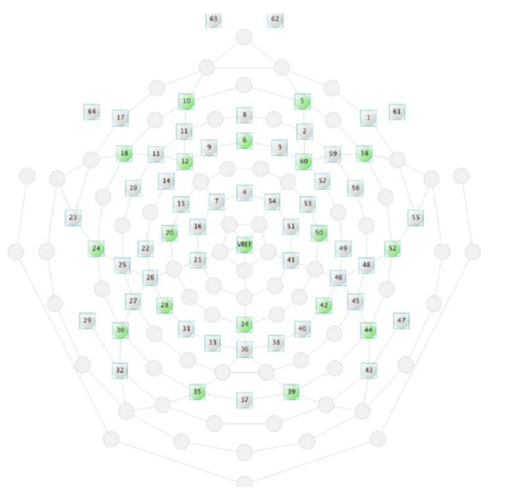
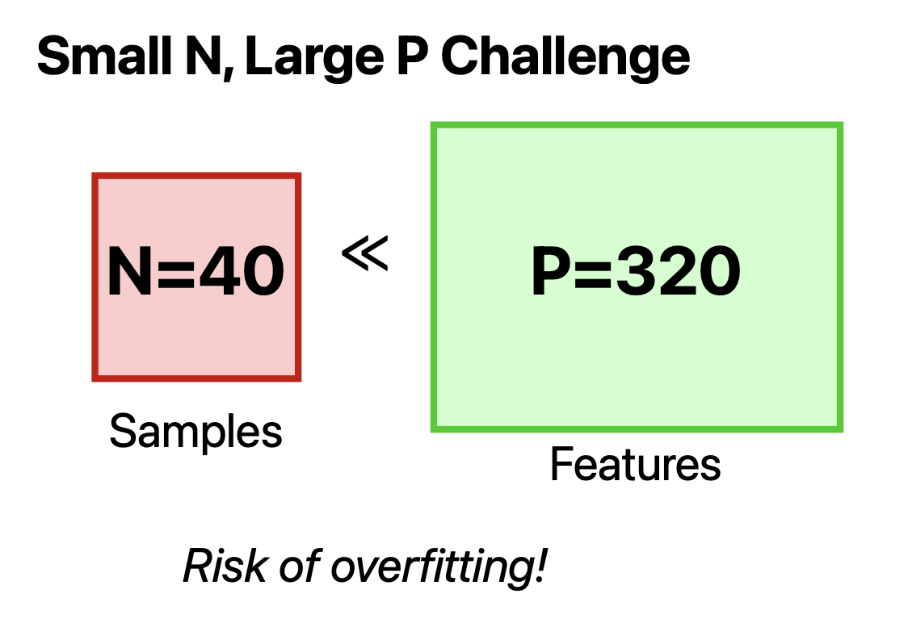
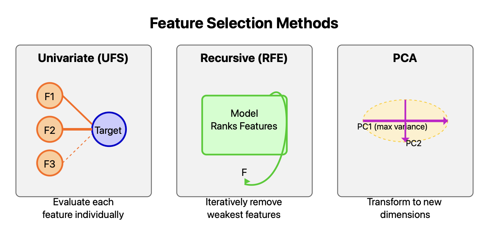
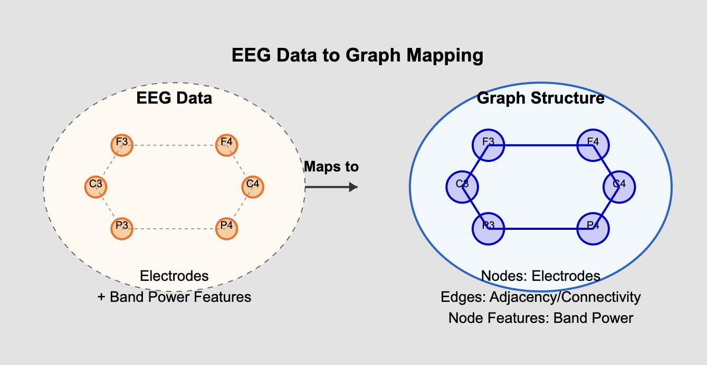

# EEG Classification for Metabolic State Detection: Detailed Analysis

## 1. Introduction: Understanding the Data

This project analyzes Electroencephalography (EEG) data to classify brain states associated with different metabolic conditions.

### EEG Basics

*   **Technique:** Records electrical activity from the scalp.
*   **Setup:** 64 electrodes placed according to an extended 10-20 system.
*   **Features:** Power spectral density calculated for 5 standard frequency bands at each electrode.

*(Figure: 64-Channel EEG Electrode Configuration)*

### Frequency Bands Analyzed

| Band    | Frequency Range | Associated Brain States                                |
| :------ | :-------------: | :----------------------------------------------------- |
| Delta   | 0.5 - 4 Hz      | Deep sleep, non-REM sleep                              |
| Theta   | 4 - 8 Hz        | Drowsiness, meditation, creativity, light sleep        |
| Alpha   | 8 - 13 Hz       | Relaxed wakefulness, calmness, eyes closed             |
| Beta    | 13 - 30 Hz      | Active thinking, concentration, alertness, anxiety     |
| Gamma   | 30 - 100 Hz     | Higher cognitive processing, learning, sensory binding |

## 2. Dataset Overview

 *(Note: This is a placeholder, replace with your actual pipeline diagram if different)*
*(Figure: High-Level Project Pipeline)*

| Characteristic      | Value                                              | Implication                                       |
| :------------------ | :------------------------------------------------- | :------------------------------------------------ |
| **Samples**         | 40 (20 per class)                                  | Extremely small dataset size                      |
| **Features**        | 320 (64 electrodes × 5 bands)                      | High-dimensional space                            |
| **Target**          | Binary (0 or 1 metabolic state)                    | Balanced classification task                      |
| **Primary Challenge** | **N << P** (Samples << Features)                   | High risk of overfitting, unreliable evaluation   |

*(Figure: Conceptual Icon for N << P)*

## 3. Task 1: Baseline Classification Models

Evaluation of standard ML algorithms as requested in the preliminary task. Results below primarily focus on robust 5-Fold Cross-Validation.

### Baseline Performance (5-Fold Cross-Validation)

Repeating the baseline evaluation with robust 5-Fold CV confirms the poor performance:

| Model                | Avg. Accuracy | Avg. F1 Score | Avg. AUC | Notes                  |
| :------------------- | :-----------: | :-----------: | :------: | :--------------------- |
| Logistic Regression  | 0.300 ± 0.100 | 0.359 ± 0.090 | 0.288 ± 0.094 | Poor generalization    |
| SVM (RBF Kernel)     | 0.375 ± 0.079 | 0.226 ± 0.192 | 0.213 ± 0.123 | Near chance            |
| SVM (Linear Kernel)  | 0.300 ± 0.100 | 0.328 ± 0.082 | 0.275 ± 0.146 | Poor generalization    |
| SVM (Poly Kernel)    | **0.400 ± 0.050** | 0.109 ± 0.218 | 0.138 ± 0.139 | Highest Acc, low AUC   |
| SVM (Sigmoid Kernel) | 0.325 ± 0.100 | 0.223 ± 0.206 | 0.138 ± 0.092 | Near chance            |
| KNN (k=5 / k=7)      | 0.000 ± 0.000 | 0.000 ± 0.000 | 0.000 ± 0.000 | Failed due to high dim |

*Conclusion: Standard methods struggle significantly on this limited, high-dimensional dataset.*

*(Figure: PCA shows poor linear separability, consistent with low linear model performance)*

## 4. Task 2: Feature Selection & Dimensionality Reduction

Exploring ways to reduce the 320 features to potentially more informative subsets, as requested.

### Feature Selection Methods & Results

*(Figure: Conceptual difference between UFS, RFE, and PCA)*

| Method | Top 5 Features (Example Run)                          | Evaluation Strategy                      |
| :----- | :---------------------------------------------------- | :--------------------------------------- |
| **UFS** | `alpha10`, `gamma23`, `gamma34`, `gamma38`, `gamma45` | Individual feature statistical relevance |
| **RFE** | `alpha41`, `beta43`, `theta21`, `theta29`, `theta62`  | Iterative model-based feature removal    |
| **PCA** | `beta17`, `theta1`, `delta6`, `delta47`, `delta45`   | Variance maximization via projection     |

*Note: PCA features are original features with highest loadings on top components.*

*(Figure: Univariate scores (f_classif p-values) for all features. Many features have low scores.)*

### Why Selected Features Differ & Impact

*   **UFS:** Looks at features in isolation.
*   **RFE:** Considers feature importance in the context of a specific predictive model.
*   **PCA:** Focuses on data variance, not direct prediction.
*   **Impact:** Using these selected subsets in models did *not* yield significantly better cross-validated results (see notebooks), again pointing to the core data limitation rather than just feature redundancy.

## 5. Novel Exploration: Graph Neural Networks (GNNs)

Beyond the specific tasks, GNNs were explored to leverage the spatial topology of EEG electrodes, capitalizing on the non-independence of channels.

### Motivation for GNN Exploration

*   **Spatial Structure:** Electrodes have known adjacency.
*   **Complex Patterns:** Potential to model spatial-spectral interactions.
*   **Inductive Bias:** Graph structure might help regularize given limited data.

### GNN Implementation

*(Figure: Representing EEG data as a graph: Electrodes->Nodes, Adjacency->Edges, Band Power->Features)*

*(Figure: Simplified GCN model structure: GCN Layers -> Pooling -> Classifier)*

*(Figure: 5-Fold CV process for GNNs including feature engineering & scaling within each fold)*

*   **Nodes:** 64 EEG Electrodes.
*   **Edges:** Defined by electrode adjacency.
*   **Node Features (Engineered):** 12 features per node (5 original bands + 5 regional avg. bands + 2 band ratios).
*   **Model:** Graph Convolutional Network (GCN).
*   **Evaluation:** Stratified 5-Fold Cross-Validation.

### GNN Results (5-Fold CV)

| GNN Configuration             | Avg. Accuracy | Avg. F1 Score | Avg. AUC | Notes                                      |
| :---------------------------- | :-----------: | :-----------: | :------: | :----------------------------------------- |
| GCN + Feat. Eng. (12 feat/node) | 0.500 ± 0.137 | 0.493 ± 0.259 | **0.563 ± 0.163** | Marginally better AUC, still near chance |

*(Figure: Example GNN training/validation curves, often showing overfitting or stagnation)*

*Limitations: Even with added structural information and feature engineering, GNN performance remained constrained by data scarcity.*

## 6. Comparative Summary (Cross-Validated Performance)

Comparing the most robust evaluations across the required tasks and the novel exploration:

| Approach                          | Best Avg. Accuracy | Best Avg. F1 Score | Best Avg. AUC | Primary Limitation Highlighted          |
| :-------------------------------- | :----------------: | :----------------: | :-----------: | :-------------------------------------- |
| Baseline ML (Task 1 - 5-Fold CV)  | 0.400 ± 0.050      | 0.359 ± 0.090      | 0.288 ± 0.094 | Data scarcity, high dimensionality      |
| GNN Exploration (5-Fold CV)       | 0.500 ± 0.137      | 0.493 ± 0.259      | **0.563 ± 0.163** | Data scarcity, signal strength          |

 *(Figure: Bar chart comparing Baseline CV vs GNN CV AUC/Accuracy)*

*Key Takeaway: No method reliably classifies the data above chance levels when evaluated properly. The GNN exploration, while yielding the highest average AUC, did not fundamentally solve the data limitation problem.*

## 7. Conclusions & Future Directions

### Key Findings

1.  **Task Completion:** Preliminary tasks 1 (baseline models) and 2 (feature selection) were completed, revealing the dataset's challenging nature.
2.  **Data Scarcity:** The N=40 sample size is the primary obstacle to building generalizable models.
3.  **Limited Signal:** Static band power features appear insufficient for robust classification with this sample size.
4.  **Novel Approach Confirms Limits:** The additional GNN exploration, despite incorporating relevant structural information, also yielded near-chance performance, further emphasizing the data limitation.

### Next Steps & Project Relevance

*   The limitations found here motivate the **GSOC NEURODYAD project's focus on CEBRA**.
*   CEBRA is designed for high-dimensional **time-series** data, potentially capturing richer dynamics.
*   Future work should focus on:
    *   Implementing **CEBRA** on appropriate time-locked dyadic EEG.
    *   Applying advanced **post-embedding analyses** (TDA, dynamics) to CEBRA outputs.
*   This preliminary work successfully demonstrated evaluation methodologies and highlighted the specific challenges CEBRA aims to address.

**Repository:** [github.com/daksh-mor/cebra/tree/main](https://github.com/daksh-mor/cebra/tree/main)
